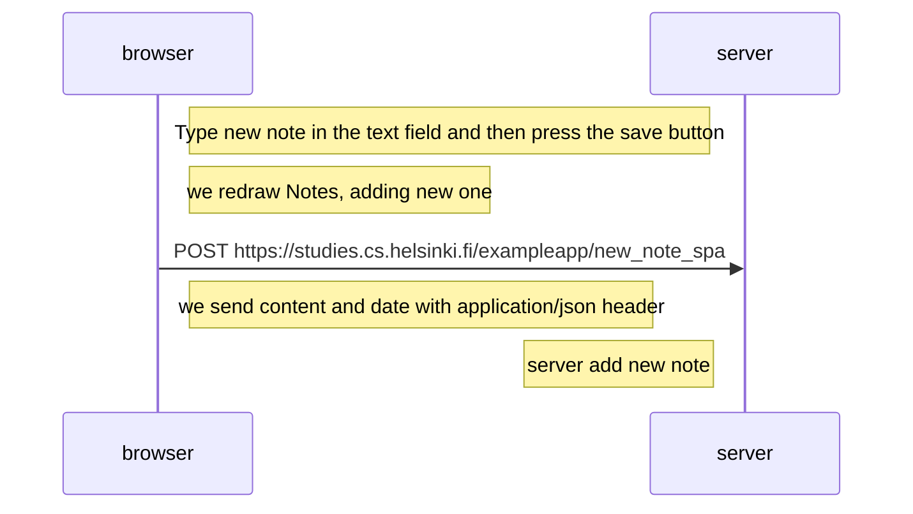

# Sequence diagram for create new note in SPA

```mermaid
sequenceDiagram
    participant browser
    participant server

    Note right of browser: Type new note in the text field and then press the save button
    Note right of browser: we redraw Notes, adding new one
    browser->>server: POST https://studies.cs.helsinki.fi/exampleapp/new_note_spa
    activate server
    Note right of browser: we send content and date with application/json header
    Note left of server: server add new note
```
